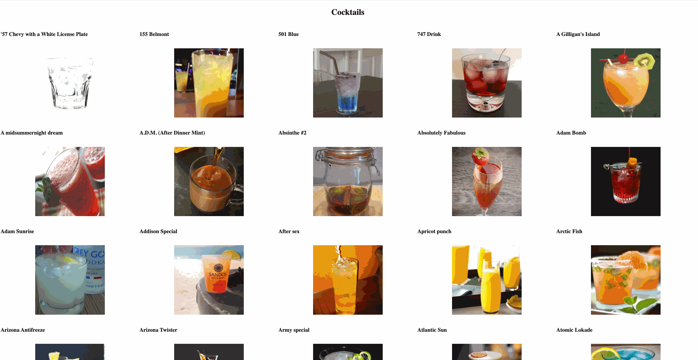

# Eric's HRLA React Workshop
Created Feb 3, 2021

#### Please scroll down to the `INSTRUCTIONS` for information on how to get started with coding.

----
## What is React?
[React](https://reactjs.org/docs/hello-world.html) is a JavaScript **library** used in creating interactive UIs (user interfaces) on the front-end of an application.

#### What are some of the things that make React unique?

1) [The Virtual DOM](https://reactjs.org/docs/faq-internals.html)
>The virtual DOM is a programming concept where an ideal, or "virtual", representation of a UI is kept in memory, and synced with the "real" DOM by a library such as **ReactDOM**.

2) [Components](https://reactjs.org/docs/components-and-props.html)
>Using components allows you to split the UI into independent, reusable pieces, and think about each piece in isolation. See the **React Component API reference** [here](https://reactjs.org/docs/react-component.html).

3) [JSX syntax / file extensions](https://reactjs.org/docs/introducing-jsx.html)
> JSX is a **syntax extension to JavaScript**. It allows for separation of *concerns*, rather than separation of *technologies* (i.e. HTML vs. JavaScript). React doesn't *require* use of .jsx file extensions, but most find it useful as a visual aid, and it also allows React to show more useful error and warning messages for debugging.

----
## How React works

### Component Types
**Stateless / Functional**

* Should be used when you have no use for state or lifecycle methods
* Newly added to React, you can use state with functional components by creating a [React hook](https://reactjs.org/docs/hooks-overview.html) and "hooking into using React state".

**Stateful / Class**

* Should be used whenever you need to use state or [lifecycle methods](https://reactjs.org/docs/state-and-lifecycle.html).
* Newly added to React, you can use state with functional components by creating a [**React hook**](https://reactjs.org/docs/hooks-overview.html). See the React hooks API [here](https://reactjs.org/docs/hooks-reference.html).

# INSTRUCTIONS

----
## How to get started
1. Ensure that you have [Node](https://nodejs.org/en/) installed
2. Ensure that you have **forked** and **cloned** this [repo](https://github.com/uncosung/react-test) to your computer with `git clone https://github.com/uncosung/react-test.git`, then `cd react-test`
3. Read through the endpoints used in [TheCocktailDb](https://www.thecocktaildb.com/api.php)

Then,

1. Open a terminal tab, and run `npm install` to download the dependenices.
2. In that same tab (after completion), run `npm start` to start your node server.
3. In a **NEW** terminal tab, run `npm run build` to start Webpack, which will watch and auto-transpile your files (using Babel). *Make sure this tab remains running*.
4. Open up a chrome tab at `localhost:3001` to see your code being rendered.

----
## Overview of this repo

* With this project, we will be creating an application that will display a list of cocktails made with a searched ingredient.

* Our task is to build out functionalities to **render** a default list of cocktails, **search** for cocktails based on an ingredient, and **view details** of each cocktail. *Let's get started!*

----
## Checklist of Features to Complete

### Step 1: Connect your React app to the browser, using `index.js`

* Render `App.jsx` to our `index.html`.

----
### Step 2: Start writing out `App.jsx` component

* Create **App**, as a *stateful/class* component.
* Create a piece of state to store an array of drinks, which will be used to render a list of cocktails.
* Render the **List** component inside of the **App** component.

----
### Step 3: Write out `List.jsx` and `ListItem.jsx`

* Create both **List** and **ListItem** as *functional* components.
* Connect the two components (in React style), using the comments at the top of each file as a guideline.

> Leave this hard-coded for now; we will refactor momentarily.

----
### Step 4: Check your work

* Make sure you are able to see the hard-coded **List** and **ListItems** in your browser.

----
### Step 5: Refactor `List.jsx` and `ListItems.jsx` for variable data

*  **List** should render one **ListItem** for each drink in the array in **App**'s state

* **ListItem** components should be able to conditionally render the drink's `strDrink` (name), and `strDrinkThumb` (thumbnail image) based on what is passed down to it via `props`.

----
### Step 6: Check your work

* Set **App**'s state to a real list of cocktails, by importing and using `dummy.js`
* You should see a rendered list of cocktails, with their name and image displayed.

----
### Step 7: Write out `Search.jsx`

* Create **Search** as a *stateful/class* component
* Create a piece of state to store user input in the text field

----
### Step 8: Add functionality to `Search.jsx`

* Capture the information typed into the `<form>`, so that we can update **App**'s state with it.

>We can do this by implementing & updating state within the **Search** component.

1) Write out functionality to update the state of **Search** as it changes with user input. *Hint: you may need the `onChange` listener!*
2) Write out functionality that takes the updated state and calls the function to update **App**'s state with the new drinks after making an HTTP request to TheCocktailDB API.

### Step 9: Write out `Details.jsx`

* Create **Details** as a *functional* component.
* The component should render the details of a specific drink that is returned as the result of an HTTP request to TheCocktailDB API. *Hint: Take a look at the id of each listItem*

### Step 10: Add functionality to `App.jsx` that will handle `listItem` clicks and conditionally render a new page
* Read through the React [Documentation](https://reactjs.org/docs/conditional-rendering.html) to get a better understanding of conditional rendering
* Have some way to check state and render different components based on what we want to display on the page

**Further steps to test your abilities are to come!**